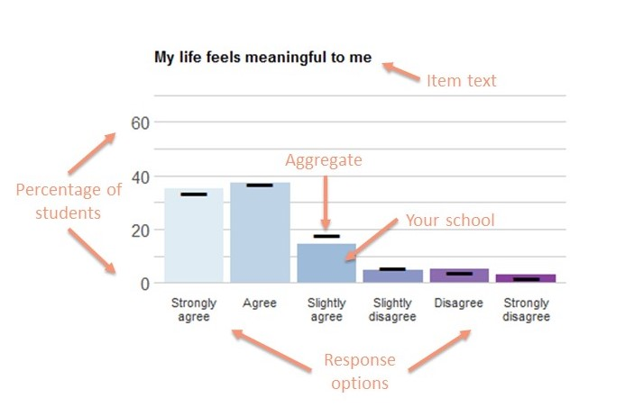
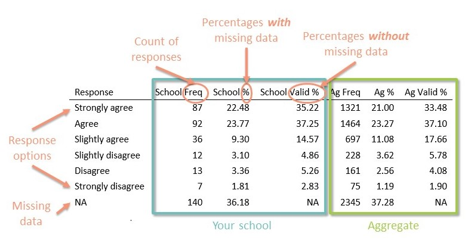

```{r setup, include=FALSE}
knitr::opts_chunk$set(echo = TRUE)

#To run this document, in charts_and_tables:
#(1) set the school name, and (2) turn on/off the 
#custom/additional items. (3) If you are running 
#custom/additional items, you will need to turn 
#them on/off at end of this document. Use ctrl_shift_c.
#Don't forget #to turn the "Additional Items"
#and "Custom Items" titles on/off.

#(4)In this document, set "Author" in the yaml to the name of the school whose report you are running.

#If you are running a benchmark
#or other special report, in import_and_clean,
#(5) update list the schools to be included.


#Also, set the source for the jpegs in the instructions.

library(knitr)

```


```{r echo=FALSE, cache=FALSE, warning= FALSE, error=FALSE, message=FALSE, include= FALSE}
read_chunk('charts_and_tables_wb_report.R')
```

```{r chartstables, echo=FALSE, warning= FALSE, error= FALSE, include= FALSE}
```


#How to Read this Document
  This document summarizes your school's data from the Spring 2018 Wake Forest University Wellbeing Assessment.  

##Navigating your report
  The report is broken down according to sections of the Wellbeing Assessment, which are organized in alphabetical order with the following exception: Demographics, Additional Items, and Custom Items.  These appear at the end of the report.
  
  **_The table of contents can be used to navigate from section to section_**. Simply *Ctrl + click* on the section heading in the table of contents to move to that section. The footer of each page contains a hyperlink that says "Click here to return to table of contents". If you open the footer, you can *Ctrl + click* on that link to navigate back to the table of contents.

###Additional Items and Custom Items
  Each school had the opportunity to select up to two sets of Additional Items from the following: Campus Safety, Medical Care, Mental Health Care, and Money.  Each school also had the opportunity to add up to 3 custom items.  If you opted to include Additional Items and/or Custom Items in your survey, they will appear at the end of your report (after the demographics) and will be indicated by section headings _Additional Items_ and _Custom Items_.

##Reading your report
  The data is summarized using **charts** and **tables**, which provide information on the number and proportion of students who responded in a given way to each item. Some items do not have a chart because the data was best represented in a table or some other form.  Below is more information on how to read the charts and tables. 

#####break
###Charts

```{r, echo=FALSE, warning=FALSE, message=FALSE, fig.height= 2.75, fig.width= 4}

```  
  
  Each bar on the bar chart represents the percentage of students at your school who endorsed a particular response option for the given item. The bold black lines represent the percentage of students in the aggregated sample of all schools who endorsed a particular response. The item text is at the top of the chart and the response options are indicated along the bottom of the chart. Charts for Additional Items and Custom items do not include aggregate data.

#####break
###Tables

```{r, echo=FALSE, warning=FALSE, message=FALSE, fig.height=2.5, fig.width=5}

```

Following the bar chart is frequency table for each item. There are two sets of 3 columns.  The left-hand columns labeled _School_ represent students at your school, and the right-hand columns labeled _Ag_ represent students from the aggregate sample of all schools.  The _Freq_ column indicates the raw number of students who endorsed each response option.  The _%_ column indicates the proportion of students who endorsed each response option, including those who did not provide a response (indicated in the table as _NA's_).  The _Valid %_ column indicates the proportion of students who endorsed each response option, not including those who did not provide a response.  __The _Valid %_ provides the most useful interpretation of the data and is identical to the percentage indicated in the bar chart__. For items with no chart, the item text is indicated at the top of the table. Tables for Additional and Custom items do not include aggregate data.

#Summary Statistics
##Your School
* Total N of participants =  `r school_n`
* Mean age of participants = `r meanage`
* Gender:
    + Female = `r femaleschool`%
    + Male = `r maleschool`%
    + Other = `r otherschool`%
* Class standing:
    + First year or freshman = `r schfreshvalid`%
    + Sophomore = `r schsophvalid`% 
    + Junior = `r schjunvalid`% 
    + Senior = `r schsenvalid`% 
  
##Aggregate
* Total N of participants =  `r ag_n`
* Mean age of participants = `r meanage_ag`
* Gender:
    + Female = `r femaleschool_ag`%
    + Male = `r maleschool_ag`%
    + Other = `r otherschool_ag`%
* Class standing:
    + First year or freshman = `r agfreshvalid`% 
    + Sophomore = `r agsophvalid`% 
    + Junior = `r agjunvalid`% 
    + Senior = `r agsenvalid`% 

#Academic Engagement
_This set of items asks you about your academic experience._

_Please rate how strongly you agree or disagree with the following statements._

####ACAENG_1

```{r echo=FALSE, cache=FALSE, warning=FALSE, error=FALSE, message=FALSE}
cacaeng_1
tacaeng_1
```

####ACAENG_2

```{r echo=FALSE, cache=FALSE, warning=FALSE, error=FALSE, message=FALSE}
cacaeng_2
tacaeng_2
```

####ACAENG_3

```{r echo=FALSE, cache=FALSE, warning=FALSE, error=FALSE, message=FALSE}
cacaeng_3
tacaeng_3
```


#Academic Outcomes
_This set of items asks about your work and academic plans._

_How likely is it that you will do any of the following:_

####OUTCOMES_1

```{r echo=FALSE, cache=FALSE, warning=FALSE, error=FALSE, message=FALSE}
coutcomes_1
toutcomes_1
```

####OUTCOMES_2

```{r echo=FALSE, cache=FALSE, warning=FALSE, error=FALSE, message=FALSE}
coutcomes_2
toutcomes_2
```

####OUTCOMES_3

```{r echo=FALSE, cache=FALSE, warning=FALSE, error=FALSE, message=FALSE}
coutcomes_3
toutcomes_3
```

#Activity Engagement
_This set of items asks about the activities you are involved in._

##Activities
_In an average week, do you participate in any of the following?_

####ACT1_1
*Social fraternity or sorority*

```{r echo=FALSE, cache=FALSE, warning=FALSE, error=FALSE, message=FALSE}
tact1_1
```

####ACT1_2: 
*Academic fraternity or honor society*

```{r echo=FALSE, cache=FALSE, warning=FALSE, error=FALSE, message=FALSE}
tact1_2
```

####ACT1_3:
*Varsity sport*

```{r echo=FALSE, cache=FALSE, warning=FALSE, error=FALSE, message=FALSE}
tact1_3
```

####ACT1_4: 
*Club/intramural sport*

```{r echo=FALSE, cache=FALSE, warning=FALSE, error=FALSE, message=FALSE}
tact1_4
```

####ACT1_5:
*Campus recreation activities (e.g. group fitness classes, outdoor excursions, etc.)*

```{r echo=FALSE, cache=FALSE, warning=FALSE, error=FALSE, message=FALSE}
tact1_5
```

####ACT1_6: 
*Performing arts group*

```{r echo=FALSE, cache=FALSE, warning=FALSE, error=FALSE, message=FALSE}
tact1_6
```

####ACT1_7: 
*Community service group*

```{r echo=FALSE, cache=FALSE, warning=FALSE, error=FALSE, message=FALSE}
tact1_7
```

####ACT1_8: 
*Spiritual/faith-based group*

```{r echo=FALSE, cache=FALSE, warning=FALSE, error=FALSE, message=FALSE}
tact1_8
```

####ACT1_9: 
*Political group*

```{r echo=FALSE, cache=FALSE, warning=FALSE, error=FALSE, message=FALSE}
tact1_9
```

####ACT1_10: 
*Student government*

```{r echo=FALSE, cache=FALSE, warning=FALSE, error=FALSE, message=FALSE}
tact1_10
```

####ACT1_11: 
*Cultural/ethnic organization*

```{r echo=FALSE, cache=FALSE, warning=FALSE, error=FALSE, message=FALSE}
tact1_11
```

####ACT1_12: 
*Media group (e.g. newspaper, radio station, etc.)*

```{r echo=FALSE, cache=FALSE, warning=FALSE, error=FALSE, message=FALSE}
tact1_12
```

####ACT1_13:
*Other*

```{r echo=FALSE, cache=FALSE, warning=FALSE, error=FALSE, message=FALSE}
tact1_13
```


##Outcomes
_Thinking about all the activities you are involved in at your school, please rate how strongly you agree or disagree with the following statements._

####ACT2_1

```{r echo=FALSE, cache=FALSE, warning=FALSE, error=FALSE, message=FALSE}
cact2_1
tact2_1
```

####ACT2_2

```{r echo=FALSE, cache=FALSE, warning=FALSE, error=FALSE, message=FALSE}
cact2_2
tact2_2
```

####ACT2_3

```{r echo=FALSE, cache=FALSE, warning=FALSE, error=FALSE, message=FALSE}
cact2_3
tact2_3
```

##Pathways
_Thinking about all the activities you are involved in at your school, please rate how strongly you agree or disagree with the following statements._

####ACT2_4

```{r echo=FALSE, cache=FALSE, warning=FALSE, error=FALSE, message=FALSE}
cact2_4
tact2_4
```

####ACT2_5

```{r echo=FALSE, cache=FALSE, warning=FALSE, error=FALSE, message=FALSE}
cact2_5
tact2_5
```

####ACT2_6

```{r echo=FALSE, cache=FALSE, warning=FALSE, error=FALSE, message=FALSE}
cact2_6
tact2_6
```

####ACT2_7

```{r echo=FALSE, cache=FALSE, warning=FALSE, error=FALSE, message=FALSE}
cact2_7
tact2_7
```

####ACT2_8

```{r echo=FALSE, cache=FALSE, warning=FALSE, error=FALSE, message=FALSE}
cact2_8
tact2_8
```

####ACT2_9

```{r echo=FALSE, cache=FALSE, warning=FALSE, error=FALSE, message=FALSE}
cact2_9
tact2_9
```

####ACT2_10

```{r echo=FALSE, cache=FALSE, warning=FALSE, error=FALSE, message=FALSE}
cact2_10
tact2_10
```

####ACT3
**NOTE:** **_People who agreed with ACT2_10 received the following items._**

_Thinking more about being too busy to participate in extracurricular activities, which of the following get in the way? (Select all that apply)_

```{r echo=FALSE, cache=FALSE, warning=FALSE, error=FALSE, message=FALSE}
tact3
```

#Belonging
_This set of items asks you about your sense of belonging to your school._

##Outcomes
_Please rate how strongly you agree or disagree with the following statements._

####BELONG_10

```{r echo=FALSE, cache=FALSE, warning=FALSE, error=FALSE, message=FALSE}
cbelong_10
tbelong_10
```

####BELONG_11

```{r echo=FALSE, cache=FALSE, warning=FALSE, error=FALSE, message=FALSE}
cbelong_11
tbelong_11
```

####BELONG_12

```{r echo=FALSE, cache=FALSE, warning=FALSE, error=FALSE, message=FALSE}
cbelong_12
tbelong_12
```

####BELONG_13

```{r echo=FALSE, cache=FALSE, warning=FALSE, error=FALSE, message=FALSE}
cbelong_13
tbelong_13
```

##Pathways
_Please rate how strongly you agree or disagree with the following statements._

####BELONG_1

```{r echo=FALSE, cache=FALSE, warning=FALSE, error=FALSE, message=FALSE}
cbelong_1
tbelong_1
```

####BELONG_2

```{r echo=FALSE, cache=FALSE, warning=FALSE, error=FALSE, message=FALSE}
cbelong_2
tbelong_2
```

####BELONG_3

```{r echo=FALSE, cache=FALSE, warning=FALSE, error=FALSE, message=FALSE}
cbelong_3
tbelong_3
```

####BELONG_4

```{r echo=FALSE, cache=FALSE, warning=FALSE, error=FALSE, message=FALSE}
cbelong_4
tbelong_4
```

####BELONG_5

```{r echo=FALSE, cache=FALSE, warning=FALSE, error=FALSE, message=FALSE}
cbelong_5
tbelong_5
```

####BELONG_6

```{r echo=FALSE, cache=FALSE, warning=FALSE, error=FALSE, message=FALSE}
cbelong_6
tbelong_6
```

####BELONG_7

```{r echo=FALSE, cache=FALSE, warning=FALSE, error=FALSE, message=FALSE}
cbelong_7
tbelong_7
```

####BELONG_8

```{r echo=FALSE, cache=FALSE, warning=FALSE, error=FALSE, message=FALSE}
cbelong_8
tbelong_8
```

####BELONG_9

```{r echo=FALSE, cache=FALSE, warning=FALSE, error=FALSE, message=FALSE}
cbelong_9
tbelong_9
```

#####break
###Experiences of discrimination
_This set of items asks you about your discrimination experiences at your school_

_During the current academic year, I have experienced discrimination (e.g. being excluded from activities or being the target of disparaging jokes, slurs, or comments) as a result of my:_

####BDISC_1
*Racial/ethnic background*

```{r echo=FALSE, cache=FALSE, warning=FALSE, error=FALSE, message=FALSE}
tbdisc_1
```

####BDISC_2
*Gender*

```{r echo=FALSE, cache=FALSE, warning=FALSE, error=FALSE, message=FALSE}
tbdisc_2
```

####BDISC_3
*Religious affiliation*

```{r echo=FALSE, cache=FALSE, warning=FALSE, error=FALSE, message=FALSE}
tbdisc_3
```

####BDISC_4
*Socioeconomic status*

```{r echo=FALSE, cache=FALSE, warning=FALSE, error=FALSE, message=FALSE}
tbdisc_4
```


#####break
####BDISC_5
*Political beliefs*

```{r echo=FALSE, cache=FALSE, warning=FALSE, error=FALSE, message=FALSE}
tbdisc_5
```

####BDISC_6
*Sexual orientation*

```{r echo=FALSE, cache=FALSE, warning=FALSE, error=FALSE, message=FALSE}
tbdisc_6
```

####BDISC_7
*Disability*

```{r echo=FALSE, cache=FALSE, warning=FALSE, error=FALSE, message=FALSE}
tbdisc_7
```


#Health and substance use
_This set of items asks you about your health and substance use._

###Health behaviors
_Please rate how strongly you agree or disagree with the following statements._

####HEALTH_1
```{r echo=FALSE, cache=FALSE, warning=FALSE, error=FALSE, message=FALSE}
chealth_1
thealth_1
```

####HEALTH_2
```{r echo=FALSE, cache=FALSE, warning=FALSE, error=FALSE, message=FALSE}
chealth_2
thealth_2
```

####HEALTH_3
```{r echo=FALSE, cache=FALSE, warning=FALSE, error=FALSE, message=FALSE}
chealth_3
thealth_3
```

###Health attitudes
_Please rate how strongly you agree or disagree with the following statements._

####HEALTH_4
```{r echo=FALSE, cache=FALSE, warning=FALSE, error=FALSE, message=FALSE}
chealth_4
thealth_4
```

####HEALTH_5
```{r echo=FALSE, cache=FALSE, warning=FALSE, error=FALSE, message=FALSE}
chealth_5
thealth_5
```

####HEALTH_6
```{r echo=FALSE, cache=FALSE, warning=FALSE, error=FALSE, message=FALSE}
chealth_6
thealth_6
```

####HEALTH_7
```{r echo=FALSE, cache=FALSE, warning=FALSE, error=FALSE, message=FALSE}
chealth_7
thealth_7
```

###Alcohol use
_Please rate how strongly you agree or disagree with the following statements._

####SUBST1_1
```{r echo=FALSE, cache=FALSE, warning=FALSE, error=FALSE, message=FALSE}
csubst1_1
tsubst1_1
```

####SUBST1_2
```{r echo=FALSE, cache=FALSE, warning=FALSE, error=FALSE, message=FALSE}
csubst1_2
tsubst1_2
```

####SUBST1_3
```{r echo=FALSE, cache=FALSE, warning=FALSE, error=FALSE, message=FALSE}
csubst1_3
tsubst1_3
```

####SUBST2_1
```{r echo=FALSE, cache=FALSE, warning=FALSE, error=FALSE, message=FALSE}
csubst2_1
tsubst2_1
```

####SUBST2_2
```{r echo=FALSE, cache=FALSE, warning=FALSE, error=FALSE, message=FALSE}
csubst2_2
tsubst2_2
```

####SUBST2_3
```{r echo=FALSE, cache=FALSE, warning=FALSE, error=FALSE, message=FALSE}
csubst2_3
tsubst2_3
```

####SUBST2_4
```{r echo=FALSE, cache=FALSE, warning=FALSE, error=FALSE, message=FALSE}
csubst2_4
tsubst2_4
```

####SUBST3_1
```{r echo=FALSE, cache=FALSE, warning=FALSE, error=FALSE, message=FALSE}
csubst3_1
tsubst3_1
```

####SUBST3_2
```{r echo=FALSE, cache=FALSE, warning=FALSE, error=FALSE, message=FALSE}
csubst3_2
tsubst3_2
```


#Lifelong Service
_This set of items asks you about your attitudes toward helping people._

##Outcomes
_Please rate how strongly you agree or disagree with the following statements._

####LLS_1
```{r echo=FALSE, cache=FALSE, warning=FALSE, error=FALSE, message=FALSE}
clls_1
tlls_1
```

####LLS_2
```{r echo=FALSE, cache=FALSE, warning=FALSE, error=FALSE, message=FALSE}
clls_2
tlls_2
```

####LLS_3
```{r echo=FALSE, cache=FALSE, warning=FALSE, error=FALSE, message=FALSE}
clls_3
tlls_3
```

##Pathways
_Please rate how strongly you agree or disagree with the following statements._

####LLS_4
```{r echo=FALSE, cache=FALSE, warning=FALSE, error=FALSE, message=FALSE}
clls_4
tlls_4
```

####LLS_5
```{r echo=FALSE, cache=FALSE, warning=FALSE, error=FALSE, message=FALSE}
clls_5
tlls_5
```

####LLS_6
```{r echo=FALSE, cache=FALSE, warning=FALSE, error=FALSE, message=FALSE}
clls_6
tlls_6
```

####LLS_7
```{r echo=FALSE, cache=FALSE, warning=FALSE, error=FALSE, message=FALSE}
clls_7
tlls_7
```

####LLS_8
```{r echo=FALSE, cache=FALSE, warning=FALSE, error=FALSE, message=FALSE}
clls_8
tlls_8
```

#Life Satisfaction
_This set of items asks how satisfied you are with several areas in your life._

_Please rate how strongly you agree or disagree with the following statements._

####LIFESAT_1
```{r echo=FALSE, cache=FALSE, warning=FALSE, error=FALSE, message=FALSE}
clifesat_1
tlifesat_1
```

####LIFESAT_2
```{r echo=FALSE, cache=FALSE, warning=FALSE, error=FALSE, message=FALSE}
clifesat_2
tlifesat_2
```

####LIFESAT_3
```{r echo=FALSE, cache=FALSE, warning=FALSE, error=FALSE, message=FALSE}
clifesat_3
tlifesat_3
```

####LIFESAT_4
```{r echo=FALSE, cache=FALSE, warning=FALSE, error=FALSE, message=FALSE}
clifesat_4
tlifesat_4
```

####LIFESAT_5
```{r echo=FALSE, cache=FALSE, warning=FALSE, error=FALSE, message=FALSE}
clifesat_5
tlifesat_5
```

#Meaning
_This set of items asks about your sense of meaning in life._

##Outcomes
_Please rate how strongly you agree or disagree with the following statements._

####MEANING_1
```{r echo=FALSE, cache=FALSE, warning=FALSE, error=FALSE, message=FALSE}
cmeaning_1
tmeaning_1
```

####MEANING_2
```{r echo=FALSE, cache=FALSE, warning=FALSE, error=FALSE, message=FALSE}
cmeaning_2
tmeaning_2
```

####MEANING_3
```{r echo=FALSE, cache=FALSE, warning=FALSE, error=FALSE, message=FALSE}
cmeaning_3
tmeaning_3
```

##Pathways
_Please rate how strongly you agree or disagree with the following statements._

####MEANING_4
```{r echo=FALSE, cache=FALSE, warning=FALSE, error=FALSE, message=FALSE}
cmeaning_4
tmeaning_4
```

####MEANING_5
```{r echo=FALSE, cache=FALSE, warning=FALSE, error=FALSE, message=FALSE}
cmeaning_5
tmeaning_5
```

####MEANING_6
```{r echo=FALSE, cache=FALSE, warning=FALSE, error=FALSE, message=FALSE}
cmeaning_6
tmeaning_6
```

####MEANING_7
```{r echo=FALSE, cache=FALSE, warning=FALSE, error=FALSE, message=FALSE}
cmeaning_7
tmeaning_7
```

####MEANING_8
```{r echo=FALSE, cache=FALSE, warning=FALSE, error=FALSE, message=FALSE}
cmeaning_8
tmeaning_8
```

####MEANING_9
```{r echo=FALSE, cache=FALSE, warning=FALSE, error=FALSE, message=FALSE}
cmeaning_9
tmeaning_9
```

####MEANING_10
```{r echo=FALSE, cache=FALSE, warning=FALSE, error=FALSE, message=FALSE}
cmeaning_10
tmeaning_10
```

####MEANING_11
```{r echo=FALSE, cache=FALSE, warning=FALSE, error=FALSE, message=FALSE}
cmeaning_11
tmeaning_11
```

####MEANING_12
```{r echo=FALSE, cache=FALSE, warning=FALSE, error=FALSE, message=FALSE}
cmeaning_12
tmeaning_12
```


#Mood
_These items ask you about how you have been feeling lately._

##Happiness
_Over the past two weeks, how often have you experienced any of the following:_

####HAPPY_1
```{r echo=FALSE, cache=FALSE, warning=FALSE, error=FALSE, message=FALSE}
chappy_1
thappy_1
```

####HAPPY_2
```{r echo=FALSE, cache=FALSE, warning=FALSE, error=FALSE, message=FALSE}
chappy_2
thappy_2
```

####HAPPY_3
```{r echo=FALSE, cache=FALSE, warning=FALSE, error=FALSE, message=FALSE}
chappy_3
thappy_3
```

##Anxiety
_Over the past two weeks, how often have you experienced any of the following:_

####ANX_1
```{r echo=FALSE, cache=FALSE, warning=FALSE, error=FALSE, message=FALSE}
canx_1
tanx_1
```

####ANX_2
```{r echo=FALSE, cache=FALSE, warning=FALSE, error=FALSE, message=FALSE}
canx_2
tanx_2
```

####ANX_3
```{r echo=FALSE, cache=FALSE, warning=FALSE, error=FALSE, message=FALSE}
canx_3
tanx_3
```

##Depression
_Over the past two weeks, how often have you experienced any of the following:_

####DEP_1
```{r echo=FALSE, cache=FALSE, warning=FALSE, error=FALSE, message=FALSE}
cdep_1
tdep_1
```

####DEP_2
```{r echo=FALSE, cache=FALSE, warning=FALSE, error=FALSE, message=FALSE}
cdep_2
tdep_2
```

####DEP_3
```{r echo=FALSE, cache=FALSE, warning=FALSE, error=FALSE, message=FALSE}
cdep_3
tdep_3
```

##Loneliness
_Over the past two weeks, how often have you experienced any of the following:_

####LONE_1
```{r echo=FALSE, cache=FALSE, warning=FALSE, error=FALSE, message=FALSE}
clone_1
tlone_1
```

####LONE_2
```{r echo=FALSE, cache=FALSE, warning=FALSE, error=FALSE, message=FALSE}
clone_2
tlone_2
```

####LONE_3
```{r echo=FALSE, cache=FALSE, warning=FALSE, error=FALSE, message=FALSE}
clone_3
tlone_3
```

##Social Anxiety
_Over the past two weeks, how often have you experienced any of the following:_

####SOCANX_1
```{r echo=FALSE, cache=FALSE, warning=FALSE, error=FALSE, message=FALSE}
csocanx_1
tsocanx_1
```

####SOCANX_2
```{r echo=FALSE, cache=FALSE, warning=FALSE, error=FALSE, message=FALSE}
csocanx_2
tsocanx_2
```

####SOCANX_3
```{r echo=FALSE, cache=FALSE, warning=FALSE, error=FALSE, message=FALSE}
csocanx_3
tsocanx_3
```


#Positive Relationships: Friendship
_This set of items asks you about your friendships_

##Outcomes for friends-in-general
_Please rate how strongly you agree or disagree with the following statements._

####FRIENDS_7
```{r echo=FALSE, cache=FALSE, warning=FALSE, error=FALSE, message=FALSE}
cfriends_7
tfriends_7
```

####FRIENDS_8
```{r echo=FALSE, cache=FALSE, warning=FALSE, error=FALSE, message=FALSE}
cfriends_8
tfriends_8
```

####FRIENDS_9
```{r echo=FALSE, cache=FALSE, warning=FALSE, error=FALSE, message=FALSE}
cfriends_9
tfriends_9
```

####FRIENDS_10
```{r echo=FALSE, cache=FALSE, warning=FALSE, error=FALSE, message=FALSE}
cfriends_10
tfriends_10
```

##Pathways for friends-in-general
_Please rate how strongly you agree or disagree with the following statements._

####FRIENDS_1
```{r echo=FALSE, cache=FALSE, warning=FALSE, error=FALSE, message=FALSE}
cfriends_1
tfriends_1
```

####FRIENDS_2
```{r echo=FALSE, cache=FALSE, warning=FALSE, error=FALSE, message=FALSE}
cfriends_2
tfriends_2
```

####FRIENDS_3
```{r echo=FALSE, cache=FALSE, warning=FALSE, error=FALSE, message=FALSE}
cfriends_3
tfriends_3
```

####FRIENDS_4
```{r echo=FALSE, cache=FALSE, warning=FALSE, error=FALSE, message=FALSE}
cfriends_4
tfriends_4
```

####FRIENDS_5
```{r echo=FALSE, cache=FALSE, warning=FALSE, error=FALSE, message=FALSE}
cfriends_5
tfriends_5
```

####FRIENDS_6
```{r echo=FALSE, cache=FALSE, warning=FALSE, error=FALSE, message=FALSE}
cfriends_6
tfriends_6
```


##Outcome for friends-who-are-different
_Please rate how strongly you agree or disagree with the following statements._

####DFRIENDS_4
```{r echo=FALSE, cache=FALSE, warning=FALSE, error=FALSE, message=FALSE}
cdfriends_4
tdfriends_4
```

##Pathways for friends-who-are-different
_Please rate how strongly you agree or disagree with the following statements._

####DFRIENDS_1
```{r echo=FALSE, cache=FALSE, warning=FALSE, error=FALSE, message=FALSE}
cdfriends_1
tdfriends_1
```

####DFRIENDS_2
```{r echo=FALSE, cache=FALSE, warning=FALSE, error=FALSE, message=FALSE}
cdfriends_2
tdfriends_2
```

####DFRIENDS_3
```{r echo=FALSE, cache=FALSE, warning=FALSE, error=FALSE, message=FALSE}
cdfriends_3
tdfriends_3
```


#Positive Relationships: Romantic Relationships

####ROMAN_1

```{r echo=FALSE, cache=FALSE, warning=FALSE, error=FALSE, message=FALSE}
croman_1
troman_1
```

####ROMAN_2

```{r echo=FALSE, cache=FALSE, warning=FALSE, error=FALSE, message=FALSE}
croman_2
troman_2
```

##Set 1
**NOTE:** **_People who selected "A" in ROMAN_2 received these items_**

_Please rate how strongly you agree or disagree with the following statements._

####ROMAN3_1

```{r echo=FALSE, cache=FALSE, warning=FALSE, error=FALSE, message=FALSE}
croman3_1
troman3_1
```

####ROMAN3_2
```{r echo=FALSE, cache=FALSE, warning=FALSE, error=FALSE, message=FALSE}
croman3_2
troman3_2
```

####ROMAN3_3
```{r echo=FALSE, cache=FALSE, warning=FALSE, error=FALSE, message=FALSE}
croman3_3
troman3_3
```

####ROMAN3_4
```{r echo=FALSE, cache=FALSE, warning=FALSE, error=FALSE, message=FALSE}
croman3_4
troman3_4
```

####ROMAN3_5
```{r echo=FALSE, cache=FALSE, warning=FALSE, error=FALSE, message=FALSE}
croman3_5
troman3_5
```

##Set 2
**NOTE:** **_Everyone received these items_**

_Please rate how strongly you agree or disagree with the following statements._

####ROMAN4_1
```{r echo=FALSE, cache=FALSE, warning=FALSE, error=FALSE, message=FALSE}
croman4_1
troman4_1
```

####ROMAN4_2
```{r echo=FALSE, cache=FALSE, warning=FALSE, error=FALSE, message=FALSE}
croman4_2
troman4_2
```

#Positivity
_This set of items asks about your behaviors and attitudes toward life._

##Self Esteem
_Please rate how strongly you agree or disagree with the following statements._

####SELFEST_1
```{r echo=FALSE, cache=FALSE, warning=FALSE, error=FALSE, message=FALSE}
cselfest_1
tselfest_1
```

####SELFEST_2
```{r echo=FALSE, cache=FALSE, warning=FALSE, error=FALSE, message=FALSE}
cselfest_2
tselfest_2
```

####SELFEST_3
```{r echo=FALSE, cache=FALSE, warning=FALSE, error=FALSE, message=FALSE}
cselfest_3
tselfest_3
```

####SELFEST_4
```{r echo=FALSE, cache=FALSE, warning=FALSE, error=FALSE, message=FALSE}
cselfest_4
tselfest_4
```

##Optimism
_Please rate how strongly you agree or disagree with the following statements._

####OPT_1
```{r echo=FALSE, cache=FALSE, warning=FALSE, error=FALSE, message=FALSE}
copt_1
topt_1
```

####OPT_2
```{r echo=FALSE, cache=FALSE, warning=FALSE, error=FALSE, message=FALSE}
copt_2
topt_2
```

####OPT_3
```{r echo=FALSE, cache=FALSE, warning=FALSE, error=FALSE, message=FALSE}
copt_3
topt_3
```

##Perseverance
_Please rate how strongly you agree or disagree with the following statements._

####PERS_1
```{r echo=FALSE, cache=FALSE, warning=FALSE, error=FALSE, message=FALSE}
cpers_1
tpers_1
```

####PERS_2
```{r echo=FALSE, cache=FALSE, warning=FALSE, error=FALSE, message=FALSE}
cpers_2
tpers_2
```

####PERS_3
```{r echo=FALSE, cache=FALSE, warning=FALSE, error=FALSE, message=FALSE}
cpers_3
tpers_3
```

#Purpose
_This set of items asks about your goals in life._

_By "goals", we mean plans for your life after graduation._

####PURP1
```{r echo=FALSE, cache=FALSE, warning=FALSE, error=FALSE, message=FALSE}
cpurp1
tpurp1
```

**NOTE:** **_People who selected "C" in PURP_1 skipped the remaining PURPOSE items_**

##"Have goals" Outcomes
**NOTE:** **_People who selected "A" in PURP_1 received these items_**

_Please rate how strongly you agree or disagree with the following statements._

####PURP2_1
```{r echo=FALSE, cache=FALSE, warning=FALSE, error=FALSE, message=FALSE}
cpurp2_1
tpurp2_1
```

####PURP2_2
```{r echo=FALSE, cache=FALSE, warning=FALSE, error=FALSE, message=FALSE}
cpurp2_2
tpurp2_2
```

####PURP2_3
```{r echo=FALSE, cache=FALSE, warning=FALSE, error=FALSE, message=FALSE}
cpurp2_3
tpurp2_3
```

##"Have goals" Pathways
**NOTE:** **_People who selected "A" in PURP_1 received these items_**

_Please rate how strongly you agree or disagree with the following statements._

####PURP2_4
```{r echo=FALSE, cache=FALSE, warning=FALSE, error=FALSE, message=FALSE}
cpurp2_4
tpurp2_4
```

####PURP2_5
```{r echo=FALSE, cache=FALSE, warning=FALSE, error=FALSE, message=FALSE}
cpurp2_5
tpurp2_5
```

####PURP2_6
```{r echo=FALSE, cache=FALSE, warning=FALSE, error=FALSE, message=FALSE}
cpurp2_6
tpurp2_6
```

####PURP2_7
```{r echo=FALSE, cache=FALSE, warning=FALSE, error=FALSE, message=FALSE}
cpurp2_7
tpurp2_7
```

####PURP2_8
```{r echo=FALSE, cache=FALSE, warning=FALSE, error=FALSE, message=FALSE}
cpurp2_8
tpurp2_8
```

####PURP2_9
```{r echo=FALSE, cache=FALSE, warning=FALSE, error=FALSE, message=FALSE}
cpurp2_9
tpurp2_9
```

####PURP2_10
```{r echo=FALSE, cache=FALSE, warning=FALSE, error=FALSE, message=FALSE}
cpurp2_10
tpurp2_10
```

####PURP2_11
```{r echo=FALSE, cache=FALSE, warning=FALSE, error=FALSE, message=FALSE}
cpurp2_11
tpurp2_11
```

####PURP2_12
```{r echo=FALSE, cache=FALSE, warning=FALSE, error=FALSE, message=FALSE}
cpurp2_12
tpurp2_12
```

####PURP2_13
**NOTE:** **_This item was only displayed to students who selected a major in demographic item MAJOR._**

```{r echo=FALSE, cache=FALSE, warning=FALSE, error=FALSE, message=FALSE}
cpurp2_13
tpurp2_13
```

####PURP2_14
**NOTE:** **_This item was only displayed to students who selected "undecided" in demographic item MAJOR._**

```{r echo=FALSE, cache=FALSE, warning=FALSE, error=FALSE, message=FALSE}
cpurp2_14
tpurp2_14
```

##"Defining goals" Outcomes
**NOTE:** **_People who selected "B" in PURP_1 received these items_**

_Please rate how strongly you agree or disagree with the following statements._

####PURP3_1
```{r echo=FALSE, cache=FALSE, warning=FALSE, error=FALSE, message=FALSE}
cpurp3_1
tpurp3_1
```

####PURP3_2
```{r echo=FALSE, cache=FALSE, warning=FALSE, error=FALSE, message=FALSE}
cpurp3_2
tpurp3_2
```

####PURP3_3
```{r echo=FALSE, cache=FALSE, warning=FALSE, error=FALSE, message=FALSE}
cpurp3_3
tpurp3_3
```


##"Defining goals" Pathways
**NOTE:** **_People who selected "B" in PURP_1 received these items_**

_Please rate how strongly you agree or disagree with the following statements._

####PURP3_4
```{r echo=FALSE, cache=FALSE, warning=FALSE, error=FALSE, message=FALSE}
cpurp3_4
tpurp3_4
```

####PURP3_5
```{r echo=FALSE, cache=FALSE, warning=FALSE, error=FALSE, message=FALSE}
cpurp3_5
tpurp3_5
```

####PURP3_6
```{r echo=FALSE, cache=FALSE, warning=FALSE, error=FALSE, message=FALSE}
cpurp3_6
tpurp3_6
```

####PURP3_7
```{r echo=FALSE, cache=FALSE, warning=FALSE, error=FALSE, message=FALSE}
cpurp3_7
tpurp3_7
```

####PURP3_8
```{r echo=FALSE, cache=FALSE, warning=FALSE, error=FALSE, message=FALSE}
cpurp3_8
tpurp3_8
```

####PURP3_9
```{r echo=FALSE, cache=FALSE, warning=FALSE, error=FALSE, message=FALSE}
cpurp3_9
tpurp3_9
```

####PURP3_10
```{r echo=FALSE, cache=FALSE, warning=FALSE, error=FALSE, message=FALSE}
cpurp3_10
tpurp3_10
```

####PURP3_11
```{r echo=FALSE, cache=FALSE, warning=FALSE, error=FALSE, message=FALSE}
cpurp3_11
tpurp3_11
```


#Standing up to Discrimination
##Outcomes
_Please rate how strongly you agree or disagree with the following statements._

####DISCRIM_1
```{r echo=FALSE, cache=FALSE, warning=FALSE, error=FALSE, message=FALSE}
cdiscrim_1
tdiscrim_1
```

####DISCRIM_2
```{r echo=FALSE, cache=FALSE, warning=FALSE, error=FALSE, message=FALSE}
cdiscrim_2
tdiscrim_2
```

####DISCRIM_3
```{r echo=FALSE, cache=FALSE, warning=FALSE, error=FALSE, message=FALSE}
cdiscrim_3
tdiscrim_3
```

##Pathways
_Please rate how strongly you agree or disagree with the following statements._

####DISCRIM_4
```{r echo=FALSE, cache=FALSE, warning=FALSE, error=FALSE, message=FALSE}
cdiscrim_4
tdiscrim_4
```

####DISCRIM_5
```{r echo=FALSE, cache=FALSE, warning=FALSE, error=FALSE, message=FALSE}
cdiscrim_5
tdiscrim_5
```

#Volunteerism
_This set of items asks you about your attitudes and behaviors toward volunteering._

##Outcomes
_Please rate how strongly you agree or disagree with the following statements._

####VOLUNT_1
```{r echo=FALSE, cache=FALSE, warning=FALSE, error=FALSE, message=FALSE}
cvolunt_1
tvolunt_1
```

####VOLUNT_2
```{r echo=FALSE, cache=FALSE, warning=FALSE, error=FALSE, message=FALSE}
cvolunt_2
tvolunt_2
```

####VOLUNT_3
```{r echo=FALSE, cache=FALSE, warning=FALSE, error=FALSE, message=FALSE}
cvolunt_3
tvolunt_3
```

##Pathways
_Please rate how strongly you agree or disagree with the following statements._

####VOLUNT_4
```{r echo=FALSE, cache=FALSE, warning=FALSE, error=FALSE, message=FALSE}
cvolunt_4
tvolunt_4
```

####VOLUNT_5
```{r echo=FALSE, cache=FALSE, warning=FALSE, error=FALSE, message=FALSE}
cvolunt_5
tvolunt_5
```

####VOLUNT_6
```{r echo=FALSE, cache=FALSE, warning=FALSE, error=FALSE, message=FALSE}
cvolunt_6
tvolunt_6
```

####VOLUNT_7
```{r echo=FALSE, cache=FALSE, warning=FALSE, error=FALSE, message=FALSE}
cvolunt_7
tvolunt_7
```

####VOLUNT_8
```{r echo=FALSE, cache=FALSE, warning=FALSE, error=FALSE, message=FALSE}
cvolunt_8
tvolunt_8
```

#Demographics and background

##Age, Class
####AGE

* Mean (School) = `r meanage`
* Mean (Aggregate) = `r meanage_ag`

####CLASS
```{r echo=FALSE, cache=FALSE, warning=FALSE, error=FALSE, message=FALSE}
cclass
tclass
```

#####break
##Disability
_Do you have any of the following disabilities or medical conditions? (answer each item)_

####DISABL_1
*Learning disability (dyslexia, etc.)*
```{r echo=FALSE, cache=FALSE, warning=FALSE, error=FALSE, message=FALSE}
tdisabl_1
```

####DISABL_2
*Attention-deficit/hyperactivity disorder (ADHD)*
```{r echo=FALSE, cache=FALSE, warning=FALSE, error=FALSE, message=FALSE}
tdisabl_2
```

####DISABL_3
*Physical disability (speech, sight, mobility, hearing, etc.)*
```{r echo=FALSE, cache=FALSE, warning=FALSE, error=FALSE, message=FALSE}
tdisabl_3
```

####DISABL_4
*Chronic illness (cancer, diabetes, autoimmune disorders, etc.)*
```{r echo=FALSE, cache=FALSE, warning=FALSE, error=FALSE, message=FALSE}
tdisabl_4
```

#####break
####DISABL_5
*Psychological disorder (depression, etc.)*
```{r echo=FALSE, cache=FALSE, warning=FALSE, error=FALSE, message=FALSE}
tdisabl_5
```

####DISABL_6
*Other*
```{r echo=FALSE, cache=FALSE, warning=FALSE, error=FALSE, message=FALSE}
tdisabl_6
```

#####break
##Foreign school, Gender, GPA, Housing

####FRNSCHL

_How many years of schooling before college have you received outside of the United States?_
```{r echo=FALSE, cache=FALSE, warning=FALSE, error=FALSE, message=FALSE}
tfrn
```

#####break
####GENDER
```{r echo=FALSE, cache=FALSE, warning=FALSE, error=FALSE, message=FALSE}
cgender
tgender
```

####TRANS
*Are you transgender?*
```{r echo=FALSE, cache=FALSE, warning=FALSE, error=FALSE, message=FALSE}
ttrans
```

####GPA
```{r echo=FALSE, cache=FALSE, warning=FALSE, error=FALSE, message=FALSE}
chsgpa
thsgpa
```

#####break
####Housing
```{r echo=FALSE, cache=FALSE, warning=FALSE, error=FALSE, message=FALSE}
thousing
```

#####break
##Major, Military, Parents' education
####MAJOR
_Which of these fields best describes your major? (Select up to 2)_
```{r echo=FALSE, cache=FALSE, warning=FALSE, error=FALSE, message=FALSE}
tmajor
```

#####break
####MILITARY
_Which best describes your military status: (select one)_
```{r echo=FALSE, cache=FALSE, warning=FALSE, error=FALSE, message=FALSE}
tmilitary
```

####PAREDU
```{r echo=FALSE, cache=FALSE, warning=FALSE, error=FALSE, message=FALSE}
tparedu
```

#####break
##Paying for college & loans

_How have you paid for your college costs?_

####PAY_1
*Resources from your family (e.g., parent or relative savings, etc.)*
```{r echo=FALSE, cache=FALSE, warning=FALSE, error=FALSE, message=FALSE}
tpay_1
```

####PAY_2: 
*Your own personal resources (e.g., your savings, income from a job, etc.)*

```{r echo=FALSE, cache=FALSE, warning=FALSE, error=FALSE, message=FALSE}
tpay_2
```

####PAY_3:
*Financial aid that does not need to be repaid (e.g., scholarship or grant money)*

```{r echo=FALSE, cache=FALSE, warning=FALSE, error=FALSE, message=FALSE}
tpay_3
```

####PAY_4: 
*Financial aid that does need to be repaid by you (student loans)*

```{r echo=FALSE, cache=FALSE, warning=FALSE, error=FALSE, message=FALSE}
tpay_4
```

#####break
####PAY_5:
*Loans your parents are taking out (not student loans)*
```{r echo=FALSE, cache=FALSE, warning=FALSE, error=FALSE, message=FALSE}
tpay_5
```

####PAY_6: 
*Other*

```{r echo=FALSE, cache=FALSE, warning=FALSE, error=FALSE, message=FALSE}
tpay_6
```

#####break
####LOANS
**NOTE:** **_This item was displayed to people who selected YES to PAY_4_**
```{r echo=FALSE, cache=FALSE, warning=FALSE, error=FALSE, message=FALSE}
cloans
tloans
```

#####break
##Program participation, RA
####PROGRAMS
_During the current academic year, have you attended or participated in any education or prevention programs that discuss the following topics at your school?_ 

####PROGRAMS_1
*Alcohol and other drugs*
```{r echo=FALSE, cache=FALSE, warning=FALSE, error=FALSE, message=FALSE}
tprograms_1
```

####PROGRAMS_2: 
*Sexual assault*

```{r echo=FALSE, cache=FALSE, warning=FALSE, error=FALSE, message=FALSE}
tprograms_2
```

####PROGRAMS_3:
*Nutrition*
```{r echo=FALSE, cache=FALSE, warning=FALSE, error=FALSE, message=FALSE}
tprograms_3
```

#####break
####PROGRAMS_4: 
*Wellbeing*
```{r echo=FALSE, cache=FALSE, warning=FALSE, error=FALSE, message=FALSE}
tprograms_4
```

####PROGRAMS_5:
*Stress & emotional health *
```{r echo=FALSE, cache=FALSE, warning=FALSE, error=FALSE, message=FALSE}
tprograms_5
```

####PROGRAMS_6: 
*Diversity*
```{r echo=FALSE, cache=FALSE, warning=FALSE, error=FALSE, message=FALSE}
tprograms_6
```

####PROGRAMS_7
*Other*
```{r echo=FALSE, cache=FALSE, warning=FALSE, error=FALSE, message=FALSE}
tprograms_7
```

#####break
####RA
```{r echo=FALSE, cache=FALSE, warning=FALSE, error=FALSE, message=FALSE}
tra
```

#####break
##Race/ethnicity, Sexual orientation, Spirituality, Study abroad
####Race/ethnicity (RACETHN)

**NOTE:** **_The RACETHN variable was calculated from the ETHNICITY and RACE variables to reflect federal reporting requirements as of 2007._**

```{r echo=FALSE, cache=FALSE, warning=FALSE, error=FALSE, message=FALSE}
cracethn
tracethn
```

####Sexual orientation (SEX_ORIENT)
_How do you describe your sexual orientation? (select one)_
```{r echo=FALSE, cache=FALSE, warning=FALSE, error=FALSE, message=FALSE}
csexor
tsexor
```

#####break
####Spirituality (SPIRIT)
```{r echo=FALSE, cache=FALSE, warning=FALSE, error=FALSE, message=FALSE}
tspirit
```

#####break
####Study abroad (ABROAD)
```{r echo=FALSE, cache=FALSE, warning=FALSE, error=FALSE, message=FALSE}
cabroad
tabroad
```


#####break
##Work & money
####WORK
```{r echo=FALSE, cache=FALSE, warning=FALSE, error=FALSE, message=FALSE}
cwork
twork
```

####MONEY
_What do you use that money for? (select all that apply)_
```{r echo=FALSE, cache=FALSE, warning=FALSE, error=FALSE, message=FALSE}
tmoney
```

<!-- #Additional Items -->
<!-- <!-- <!-- <!--#Additional Items -->  --> -->
<!-- ##Campus Safety -->
<!-- **Prompt:** Please rate how strongly you agree or disagree with the following statements. -->

<!-- ####Camp_Safe_Camp_Safe_1 -->
<!-- ```{r echo=FALSE, cache=FALSE, warning=FALSE, error=FALSE, message=FALSE} -->
<!-- csafe_1_noag -->
<!-- tsafe_1_noag -->
<!-- ``` -->

<!-- ####Camp_Safe_Camp_Safe_2 -->
<!-- ```{r echo=FALSE, cache=FALSE, warning=FALSE, error=FALSE, message=FALSE} -->
<!-- csafe_2_noag -->
<!-- tsafe_2_noag -->
<!-- ``` -->

<!-- ####Camp_Safe_Camp_Safe_3 -->
<!-- ```{r echo=FALSE, cache=FALSE, warning=FALSE, error=FALSE, message=FALSE} -->
<!-- csafe_3_noag -->
<!-- tsafe_3_noag -->
<!-- ``` -->


<!-- ##Medical Care -->
<!-- ####Med_Care_Med_Care_1 -->
<!-- ```{r echo=FALSE, cache=FALSE, warning=FALSE, error=FALSE, message=FALSE} -->
<!--  cmedcare_1_noag -->
<!-- tmedcare_1_noag -->
<!-- ``` -->

<!-- ####Med_Care_Med_Care_2 -->
<!-- ```{r echo=FALSE, cache=FALSE, warning=FALSE, error=FALSE, message=FALSE} -->
<!-- cmedcare_2_noag -->
<!-- tmedcare_2_noag -->
<!-- ``` -->

<!-- ####Med_Care_Med_Care_3 -->
<!-- ```{r echo=FALSE, cache=FALSE, warning=FALSE, error=FALSE, message=FALSE} -->
<!-- cmedcare_3_noag -->
<!-- tmedcare_3_noag -->
<!-- ``` -->


<!-- ##Mental Health Care -->
<!-- ####Mental_Health_Mental_Health_1 -->
<!-- ```{r echo=FALSE, cache=FALSE, warning=FALSE, error=FALSE, message=FALSE} -->
<!-- cmentcare_1_noag -->
<!-- tmentcare_1_noag -->
<!-- ``` -->

<!-- ####Mental_Health_Mental_Health_2 -->
<!-- ```{r echo=FALSE, cache=FALSE, warning=FALSE, error=FALSE, message=FALSE} -->
<!-- cmentcare_2_noag -->
<!-- tmentcare_2_noag -->
<!-- ``` -->

<!-- ####Mental_Health_Mental_Health_3 -->
<!-- ```{r echo=FALSE, cache=FALSE, warning=FALSE, error=FALSE, message=FALSE} -->
<!-- cmentcare_3_noag -->
<!-- tmentcare_3_noag -->
<!-- ``` -->

<!-- ####Mental_Health_Mental_Health_4 -->
<!-- ```{r echo=FALSE, cache=FALSE, warning=FALSE, error=FALSE, message=FALSE} -->
<!-- cmentcare_4_noag -->
<!-- tmentcare_4_noag -->
<!-- ``` -->


<!-- ##Money -->
<!-- ####Money_Money_1 -->
<!-- ```{r echo=FALSE, cache=FALSE, warning=FALSE, error=FALSE, message=FALSE} -->
<!-- cmoney_add_1_noag -->
<!-- tmoney_add_1_noag -->
<!-- ``` -->

<!-- ####Money_Money_2 -->
<!-- ```{r echo=FALSE, cache=FALSE, warning=FALSE, error=FALSE, message=FALSE} -->
<!-- cmoney_add_2_noag -->
<!-- tmoney_add_2_noag -->
<!-- ``` -->

<!-- ####Money_Money_3 -->
<!-- ```{r echo=FALSE, cache=FALSE, warning=FALSE, error=FALSE, message=FALSE} -->
<!-- cmoney_add_3_noag -->
<!-- tmoney_add_3_noag -->
<!-- ``` -->


<!-- #Custom Items -->

<!--##CA_CotA - don't turn the school name title on in the reports-->
<!-- ####CA_CotASp18_Custom_1 -->
<!-- ```{r echo=FALSE, cache=FALSE, warning=FALSE, error=FALSE, message=FALSE} -->
<!-- c_CCA_1_noag -->
<!-- t_CCA_1_noag -->
<!-- ``` -->

<!-- ####CA_CotASp18_Custom_3 -->
<!-- ```{r echo=FALSE, cache=FALSE, warning=FALSE, error=FALSE, message=FALSE} -->
<!-- c_CCA_2_noag -->
<!-- t_CCA_2_noag -->
<!-- ``` -->

<!-- ####CA_CotASp18_Custom_3 -->
<!-- ```{r echo=FALSE, cache=FALSE, warning=FALSE, error=FALSE, message=FALSE} -->
<!-- c_CCA_3_noag -->
<!-- t_CCA_3_noag -->
<!-- ``` -->


<!--##Chatham - don't turn the school name title on in the reports-->
<!-- ####ChathamSp18_Custom_1 -->
<!-- ```{r echo=FALSE, cache=FALSE, warning=FALSE, error=FALSE, message=FALSE} -->
<!-- c_chatham_1_noag -->
<!-- t_chatham_1_noag -->
<!-- ``` -->

<!-- ####ChathamSp18_Custom_3 -->
<!-- ```{r echo=FALSE, cache=FALSE, warning=FALSE, error=FALSE, message=FALSE} -->
<!-- c_chatham_2_noag -->
<!-- t_chatham_2_noag -->
<!-- ``` -->

<!-- ####ChathamSp18_Custom_3 -->
<!-- ```{r echo=FALSE, cache=FALSE, warning=FALSE, error=FALSE, message=FALSE} -->
<!-- c_chatham_3_noag -->
<!-- t_chatham_3_noag -->
<!-- ``` -->


<!-- ##Doane - don't turn the school name title on in the reports -->
<!-- ####DoaneSp18_Custom_1 -->
<!-- ```{r echo=FALSE, cache=FALSE, warning=FALSE, error=FALSE, message=FALSE} -->
<!-- c_doane_1_noag -->
<!-- t_doane_1_noag -->
<!-- ``` -->

<!-- ####DoaneSp18_Custom_3 -->
<!-- ```{r echo=FALSE, cache=FALSE, warning=FALSE, error=FALSE, message=FALSE} -->
<!-- c_doane_2_noag -->
<!-- t_doane_2_noag -->
<!-- ``` -->

<!-- ####DoaneSp18_Custom_3 -->
<!-- ```{r echo=FALSE, cache=FALSE, warning=FALSE, error=FALSE, message=FALSE} -->
<!-- c_doane_3_noag -->
<!-- t_doane_3_noag -->
<!-- ``` -->


<!-- ##Duke - don't turn the school name title on in the reports -->
<!-- ####DukeSp18_Custom_1_29 -->
<!-- ```{r echo=FALSE, cache=FALSE, warning=FALSE, error=FALSE, message=FALSE} -->
<!-- c_duke_1_noag -->
<!-- t_duke_1_noag -->
<!-- ``` -->

<!-- ####DukeSp18_Custom_1_30 -->
<!-- ```{r echo=FALSE, cache=FALSE, warning=FALSE, error=FALSE, message=FALSE} -->
<!-- c_duke_2_noag -->
<!-- t_duke_2_noag -->
<!-- ``` -->

<!-- ####DukeSp18_Custom_1_31 -->
<!-- ```{r echo=FALSE, cache=FALSE, warning=FALSE, error=FALSE, message=FALSE} -->
<!-- c_duke_3_noag -->
<!-- t_duke_3_noag -->
<!-- ``` -->


<!-- ##ECU - don't turn the school name title on in the reports -->
<!-- ####ECUSp18_Custom_1 -->
<!-- ```{r echo=FALSE, cache=FALSE, warning=FALSE, error=FALSE, message=FALSE} -->
<!-- c_ecu_1_noag -->
<!-- t_ecu_1_noag -->
<!-- ``` -->

<!-- ####ECUSp18_Custom_2 -->
<!-- ```{r echo=FALSE, cache=FALSE, warning=FALSE, error=FALSE, message=FALSE} -->
<!-- c_ecu_2_noag -->
<!-- t_ecu_2_noag -->
<!-- ``` -->

<!-- ####ECUSp18_Custom_3 -->
<!-- ```{r echo=FALSE, cache=FALSE, warning=FALSE, error=FALSE, message=FALSE} -->
<!-- c_ecu_3_noag -->
<!-- t_ecu_3_noag -->
<!-- ``` -->


<!--##GA Tech - don't turn the school name title on in the reports-->
<!-- ####GTSp18_Custom_1 -->
<!-- ```{r echo=FALSE, cache=FALSE, warning=FALSE, error=FALSE, message=FALSE} -->
<!-- c_gt_1_noag -->
<!-- t_gt_1_noag -->
<!-- ``` -->

<!-- ####GTSp18_Custom_2 -->
<!-- ```{r echo=FALSE, cache=FALSE, warning=FALSE, error=FALSE, message=FALSE} -->
<!-- c_gt_2_noag -->
<!-- t_gt_2_noag -->
<!-- ``` -->

<!-- ####GTSp18_Custom_3 -->
<!-- ```{r echo=FALSE, cache=FALSE, warning=FALSE, error=FALSE, message=FALSE} -->
<!-- c_gt_3_noag -->
<!-- t_gt_3_noag -->
<!-- ``` -->


<!--##Juniata - don't turn the school name title on in the reports-->
<!-- ####JuniataSp18_Custom_1 -->
<!-- ```{r echo=FALSE, cache=FALSE, warning=FALSE, error=FALSE, message=FALSE} -->
<!-- c_juniata_1_noag -->
<!-- t_juniata_1_noag -->
<!-- ``` -->

<!-- ####JuniataSp18_Custom_2 -->
<!-- ```{r echo=FALSE, cache=FALSE, warning=FALSE, error=FALSE, message=FALSE} -->
<!-- c_juniata_2_noag -->
<!-- t_juniata_2_noag -->
<!-- ``` -->

<!-- ####JuniataSp18_Custom_3 -->
<!-- ```{r echo=FALSE, cache=FALSE, warning=FALSE, error=FALSE, message=FALSE} -->
<!-- c_juniata_3_noag -->
<!-- t_juniata_3_noag -->
<!-- ``` -->


<!-- ##Trinity - don't turn the school name title on in the reports -->
<!-- ####TrinitySp18_Custom_1 -->
<!-- ```{r echo=FALSE, cache=FALSE, warning=FALSE, error=FALSE, message=FALSE} -->
<!-- c_trinity_1_noag -->
<!-- t_trinity_1_noag -->
<!-- ``` -->

<!-- ####TrinitySp18_Custom_2 -->
<!-- ```{r echo=FALSE, cache=FALSE, warning=FALSE, error=FALSE, message=FALSE} -->
<!-- c_trinity_2_noag -->
<!-- t_trinity_2_noag -->
<!-- ``` -->

<!-- ####TrinitySp18_Custom_3 -->
<!-- ```{r echo=FALSE, cache=FALSE, warning=FALSE, error=FALSE, message=FALSE} -->
<!-- c_trinity_3_noag -->
<!-- t_trinity_3_noag -->

<!-- ``` -->


<!--##UNC - don't turn the school name title on in the reports -->
<!-- ####UNCSp18_Custom_1 -->
<!-- ```{r echo=FALSE, cache=FALSE, warning=FALSE, error=FALSE, message=FALSE} -->
<!-- c_unc_1_noag -->
<!-- t_unc_1_noag -->
<!-- ``` -->

<!-- ####UNCSp18_Custom_2 -->
<!-- ```{r echo=FALSE, cache=FALSE, warning=FALSE, error=FALSE, message=FALSE} -->
<!-- c_unc_2_noag -->
<!-- t_unc_2_noag -->
<!-- ``` -->

<!-- ####UNCSp18_Custom_3 -->
<!-- ```{r echo=FALSE, cache=FALSE, warning=FALSE, error=FALSE, message=FALSE} -->
<!-- c_unc_3_noag -->
<!-- t_unc_3_noag -->
<!-- ``` -->


<!--##Pembroke - don't turn the school name title on in the reports-->
<!-- ####UNCPSp18_Custom_1 -->
<!-- ```{r echo=FALSE, cache=FALSE, warning=FALSE, error=FALSE, message=FALSE} -->
<!-- c_pembroke_1_noag -->
<!-- t_pembroke_1_noag -->
<!-- ``` -->

<!-- ####UNCPSp18_Custom_2 -->
<!-- ```{r echo=FALSE, cache=FALSE, warning=FALSE, error=FALSE, message=FALSE} -->
<!-- c_pembroke_2_noag -->
<!-- t_pembroke_2_noag -->
<!-- ``` -->

<!-- ####UNCPSp18_Custom_3 -->
<!-- ```{r echo=FALSE, cache=FALSE, warning=FALSE, error=FALSE, message=FALSE} -->
<!-- c_pembroke_3_noag -->
<!-- t_pembroke_3_noag -->
<!-- ``` -->


<!--##U of Richmond - don't turn the school name title on in the reports -->
<!-- ####URSp18_Custom_1 -->
<!-- ```{r echo=FALSE, cache=FALSE, warning=FALSE, error=FALSE, message=FALSE} -->
<!-- c_ur_1_noag -->
<!-- t_ur_1_noag -->
<!-- ``` -->

<!-- ####URSp18_Custom_2 -->
<!-- ```{r echo=FALSE, cache=FALSE, warning=FALSE, error=FALSE, message=FALSE} -->
<!-- c_ur_2_noag -->
<!-- t_ur_2_noag -->
<!-- ``` -->

<!-- ####URSp18_Custom_3 -->
<!-- ```{r echo=FALSE, cache=FALSE, warning=FALSE, error=FALSE, message=FALSE} -->
<!-- c_ur_3_noag -->
<!-- t_ur_3_noag -->
<!-- ``` -->


<!--##Wake - don't turn the school name title on in the reports-->
<!-- ####WakeSp18_Custom_1 -->
<!-- ```{r echo=FALSE, cache=FALSE, warning=FALSE, error=FALSE, message=FALSE} -->
<!-- c_wake_1_noag -->
<!-- t_wake_1_noag -->
<!-- ``` -->
